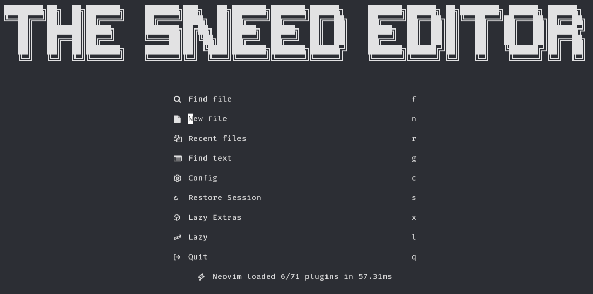

# The Sneed Editor



## My config of [LazyVim](https://github.com/LazyVim/LazyVim).

The sneed editor is nothing special. You could just as easily make it following  
the LazyVim documentation and Elijah Manor's YouTube videos. If you don't feel  
like configuring LazyVim yourself and want a kitchen sink approach to your editor  
like I do, this might be for you.

### `keymaps.lua`

Here I have set some keymaps from my nvim-config repo, based on ThePrimeagen's  
config.

| Keymap                                        | Action                                                              |
| --------------------------------------------- | ------------------------------------------------------------------- |
| `<leader>sx `                                 | Resumes last Telescope session                                      |
| `J`, `K` in visual mode                       | Moves block of text up or down                                      |
| `J` in normal mode                            | Appends line below to current line                                  |
| `<C-d>`, `<C-u>`                              | Still jumps by half a page, but cursor is centered                  |
| `n`                                           | Next item in search but keeps cursor in the middle                  |
| `<leader>p` when selecting text to paste over | Pastes without changing the paste buffer                            |
| `<leader>y`                                   | Copies content into system clipboard                                |
| `<leader>Y`                                   | Copies line into system clipboard in normal mode                    |
| `<C-c>`                                       | Maps to `<Esc>` if you're used to using `<C-c>` to exit insert mode |
| `Q`                                           | Does nothing instead of putting you in ex mode                      |
| `<leader>r`                                   | Replaces all instances of the word the cursor is on                 |
| `<leader>m`                                   | Make the current file executable                                    |

```lua
-- Keymaps are automatically loaded on the VeryLazy event
-- Default keymaps that are always set: https://github.com/LazyVim/LazyVim/blob/main/lua/lazyvim/config/keymaps.lua
-- Add any additional keymaps here
vim.keymap.set(
    "n",
    "<leader>sx",
    require("telescope.builtin").resume,
    { noremap = true, silent = true, desc = "Resume" }
)
vim.keymap.set("v", "J", ":m '>+1<CR>gv=gv")
vim.keymap.set("v", "K", ":m '<-2<CR>gv=gv")

vim.keymap.set("n", "J", "mzJ`z")
vim.keymap.set("n", "<C-d>", "<C-d>zz")
vim.keymap.set("n", "<C-u>", "<C-u>zz")
vim.keymap.set("n", "n", "nzzzv")
vim.keymap.set("n", "N", "Nzzzv")
-- greatest remap ever
vim.keymap.set("x", "<leader>p", [["_dP]])

-- next greatest remap ever : asbjornHaland
vim.keymap.set({ "n", "v" }, "<leader>y", [["+y]], { desc = "Yank to system clipboard" })
vim.keymap.set("n", "<leader>Y", [["+Y]], { desc = "Yank line to system clipboard" })
-- This is going to get me cancelled
vim.keymap.set("i", "<C-c>", "<Esc>")

vim.keymap.set("n", "Q", "<nop>")
vim.keymap.set("n", "<leader>r", [[:%s/\<<C-r><C-w>\>/<C-r><C-w>/gI<Left><Left><Left>]], { desc = "Replace word" })
vim.keymap.set("n", "<leader>m", "<cmd>!chmod +x %<CR>", { silent = true, desc = "Make executable" })
```

### `lazy.lua`

Just a kitchen sink of languages, formatters, and other stuff.  
Imported alpha so I could use alpha for the logo instead of dashboard

```lua
--Non-default imports
        { import = "lazyvim.plugins.extras.lang.typescript" },
        { import = "lazyvim.plugins.extras.lang.json" },
        { import = "lazyvim.plugins.extras.linting.eslint" },
        { import = "lazyvim.plugins.extras.formatting.prettier" },
        { import = "lazyvim.plugins.extras.formatting.black" },
        { import = "lazyvim.plugins.extras.ui.alpha" },
        { import = "lazyvim.plugins.extras.dap.core" },
        { import = "lazyvim.plugins.extras.lang.java" },
        { import = "lazyvim.plugins.extras.lang.clangd" },
        { import = "lazyvim.plugins.extras.lang.python" },
        { import = "lazyvim.plugins.extras.lang.tailwind" },
        { import = "lazyvim.plugins.extras.lang.rust" },
        { import = "lazyvim.plugins.extras.lang.markdown" },
        { import = "lazyvim.plugins.extras.editor.symbols-outline" },
        { import = "lazyvim.plugins.extras.util.mini-hipatterns" },
        { import = "lazyvim.plugins.extras.util.dot" },
```

### `options.lua`

Stuff like 4 space indenting, the path to the current file in the top right corner,  
incremental search, and a vertical line at 80 characters to be mindful of line  
length.

```lua
-- Options are automatically loaded before lazy.nvim startup
-- Default options that are always set: https://github.com/LazyVim/LazyVim/blob/main/lua/lazyvim/config/options.lua
-- Add any additional options here
vim.opt.winbar = "%=%m %f"

vim.opt.tabstop = 4
vim.opt.softtabstop = 4
vim.opt.shiftwidth = 4

vim.opt.swapfile = false
vim.opt.backup = false
vim.opt.undodir = os.getenv("HOME") .. "/.vim/undodir"
vim.opt.undofile = true

vim.opt.hlsearch = false
vim.opt.incsearch = true

vim.opt.scrolloff = 8
vim.opt.signcolumn = "yes"
vim.opt.isfname:append("@-@")

vim.opt.updatetime = 50

vim.opt.colorcolumn = "80"
```

### `alpha.lua`

Displays the logo, change local variable `logo` to use a different logo.

```lua
return {
    "goolord/alpha-nvim",
    opts = function(_, opts)
        local logo = [[
████████╗██╗  ██╗███████╗    ███████╗███╗   ██╗███████╗███████╗██████╗     ███████╗██████╗ ██╗████████╗ ██████╗ ██████╗
╚══██╔══╝██║  ██║██╔════╝    ██╔════╝████╗  ██║██╔════╝██╔════╝██╔══██╗    ██╔════╝██╔══██╗██║╚══██╔══╝██╔═══██╗██╔══██╗
   ██║   ███████║█████╗      ███████╗██╔██╗ ██║█████╗  █████╗  ██║  ██║    █████╗  ██║  ██║██║   ██║   ██║   ██║██████╔╝
   ██║   ██╔══██║██╔══╝      ╚════██║██║╚██╗██║██╔══╝  ██╔══╝  ██║  ██║    ██╔══╝  ██║  ██║██║   ██║   ██║   ██║██╔══██╗
   ██║   ██║  ██║███████╗    ███████║██║ ╚████║███████╗███████╗██████╔╝    ███████╗██████╔╝██║   ██║   ╚██████╔╝██║  ██║
   ╚═╝   ╚═╝  ╚═╝╚══════╝    ╚══════╝╚═╝  ╚═══╝╚══════╝╚══════╝╚═════╝     ╚══════╝╚═════╝ ╚═╝   ╚═╝    ╚═════╝ ╚═╝  ╚═╝
    ]]
        opts.section.header.val = vim.split(logo, "\n", { triempty = true })
    end,
}
```

### `colorizer.lua`

Highlights names of colours with their respective colour.

```lua
return {
    "NvChad/nvim-colorizer.lua",
    opts = {
        user_default_options = {
            tailwind = true,
            css = true,
            css_fn = true,
        },
    },
}
```

### `example.lua`

Some example configs you can add to your own config.

```lua

-- since this is just an example spec, don't actually load anything here and return an empty spec
-- stylua: ignore
if true then return {} end

-- every spec file under the "plugins" directory will be loaded automatically by lazy.nvim
--
-- In your plugin files, you can:
-- * add extra plugins
-- * disable/enabled LazyVim plugins
-- * override the configuration of LazyVim plugins
return {
    -- add gruvbox
    { "ellisonleao/gruvbox.nvim" },

    -- Configure LazyVim to load gruvbox
    {
        "LazyVim/LazyVim",
        opts = {
            colorscheme = "gruvbox",
        },
    },

    -- change trouble config
    {
        "folke/trouble.nvim",
        -- opts will be merged with the parent spec
        opts = { use_diagnostic_signs = true },
    },

    -- disable trouble
    { "folke/trouble.nvim", enabled = false },

    -- add symbols-outline
    {
        "simrat39/symbols-outline.nvim",
        cmd = "SymbolsOutline",
        keys = { { "<leader>cs", "<cmd>SymbolsOutline<cr>", desc = "Symbols Outline" } },
        config = true,
    },

    -- override nvim-cmp and add cmp-emoji
    {
        "hrsh7th/nvim-cmp",
        dependencies = { "hrsh7th/cmp-emoji" },
        ---@param opts cmp.ConfigSchema
        opts = function(_, opts)
            table.insert(opts.sources, { name = "emoji" })
        end,
    },

    -- change some telescope options and a keymap to browse plugin files
    {
        "nvim-telescope/telescope.nvim",
        keys = {
      -- add a keymap to browse plugin files
      -- stylua: ignore
      {
        "<leader>fp",
        function() require("telescope.builtin").find_files({ cwd = require("lazy.core.config").options.root }) end,
        desc = "Find Plugin File",
      },
        },
        -- change some options
        opts = {
            defaults = {
                layout_strategy = "horizontal",
                layout_config = { prompt_position = "top" },
                sorting_strategy = "ascending",
                winblend = 0,
            },
        },
    },

    -- add telescope-fzf-native
    {
        "telescope.nvim",
        dependencies = {
            "nvim-telescope/telescope-fzf-native.nvim",
            build = "make",
            config = function()
                require("telescope").load_extension("fzf")
            end,
        },
    },

    -- add pyright to lspconfig
    {
        "neovim/nvim-lspconfig",
        ---@class PluginLspOpts
        opts = {
            ---@type lspconfig.options
            servers = {
                -- pyright will be automatically installed with mason and loaded with lspconfig
                pyright = {},
            },
        },
    },

    -- add tsserver and setup with typescript.nvim instead of lspconfig
    {
        "neovim/nvim-lspconfig",
        dependencies = {
            "jose-elias-alvarez/typescript.nvim",
            init = function()
                require("lazyvim.util").on_attach(function(_, buffer)
          -- stylua: ignore
          vim.keymap.set( "n", "<leader>co", "TypescriptOrganizeImports", { buffer = buffer, desc = "Organize Imports" })
                    vim.keymap.set("n", "<leader>cR", "TypescriptRenameFile", { desc = "Rename File", buffer = buffer })
                end)
            end,
        },
        ---@class PluginLspOpts
        opts = {
            ---@type lspconfig.options
            servers = {
                -- tsserver will be automatically installed with mason and loaded with lspconfig
                tsserver = {},
            },
            -- you can do any additional lsp server setup here
            -- return true if you don't want this server to be setup with lspconfig
            ---@type table<string, fun(server:string, opts:_.lspconfig.options):boolean?>
            setup = {
                -- example to setup with typescript.nvim
                tsserver = function(_, opts)
                    require("typescript").setup({ server = opts })
                    return true
                end,
                -- Specify * to use this function as a fallback for any server
                -- ["*"] = function(server, opts) end,
            },
        },
    },

    -- for typescript, LazyVim also includes extra specs to properly setup lspconfig,
    -- treesitter, mason and typescript.nvim. So instead of the above, you can use:
    { import = "lazyvim.plugins.extras.lang.typescript" },

    -- add more treesitter parsers
    {
        "nvim-treesitter/nvim-treesitter",
        opts = {
            ensure_installed = {
                "bash",
                "html",
                "javascript",
                "json",
                "lua",
                "markdown",
                "markdown_inline",
                "python",
                "query",
                "regex",
                "tsx",
                "typescript",
                "vim",
                "yaml",
            },
        },
    },

    -- since `vim.tbl_deep_extend`, can only merge tables and not lists, the code above
    -- would overwrite `ensure_installed` with the new value.
    -- If you'd rather extend the default config, use the code below instead:
    {
        "nvim-treesitter/nvim-treesitter",
        opts = function(_, opts)
            -- add tsx and treesitter
            vim.list_extend(opts.ensure_installed, {
                "tsx",
                "typescript",
            })
        end,
    },

    -- the opts function can also be used to change the default opts:
    {
        "nvim-lualine/lualine.nvim",
        event = "VeryLazy",
        opts = function(_, opts)
            table.insert(opts.sections.lualine_x, "😄")
        end,
    },

    -- or you can return new options to override all the defaults
    {
        "nvim-lualine/lualine.nvim",
        event = "VeryLazy",
        opts = function()
            return {
                --[[add your custom lualine config here]]
            }
        end,
    },

    -- use mini.starter instead of alpha
    { import = "lazyvim.plugins.extras.ui.mini-starter" },

    -- add jsonls and schemastore packages, and setup treesitter for json, json5 and jsonc
    { import = "lazyvim.plugins.extras.lang.json" },

    -- add any tools you want to have installed below
    {
        "williamboman/mason.nvim",
        opts = {
            ensure_installed = {
                "stylua",
                "shellcheck",
                "shfmt",
                "flake8",
            },
        },
    },

    -- Use <tab> for completion and snippets (supertab)
    -- first: disable default <tab> and <s-tab> behavior in LuaSnip
    {
        "L3MON4D3/LuaSnip",
        keys = function()
            return {}
        end,
    },
    -- then: setup supertab in cmp
    {
        "hrsh7th/nvim-cmp",
        dependencies = {
            "hrsh7th/cmp-emoji",
        },
        ---@param opts cmp.ConfigSchema
        opts = function(_, opts)
            local has_words_before = function()
                unpack = unpack or table.unpack
                local line, col = unpack(vim.api.nvim_win_get_cursor(0))
                return col ~= 0
                    and vim.api.nvim_buf_get_lines(0, line - 1, line, true)[1]:sub(col, col):match("%s") == nil
            end

            local luasnip = require("luasnip")
            local cmp = require("cmp")

            opts.mapping = vim.tbl_extend("force", opts.mapping, {
                ["<Tab>"] = cmp.mapping(function(fallback)
                    if cmp.visible() then
                        cmp.select_next_item()
                    -- You could replace the expand_or_jumpable() calls with expand_or_locally_jumpable()
                    -- this way you will only jump inside the snippet region
                    elseif luasnip.expand_or_jumpable() then
                        luasnip.expand_or_jump()
                    elseif has_words_before() then
                        cmp.complete()
                    else
                        fallback()
                    end
                end, { "i", "s" }),
                ["<S-Tab>"] = cmp.mapping(function(fallback)
                    if cmp.visible() then
                        cmp.select_prev_item()
                    elseif luasnip.jumpable(-1) then
                        luasnip.jump(-1)
                    else
                        fallback()
                    end
                end, { "i", "s" }),
            })
        end,
    },
}
```

### `lsp.lua`

Ensures html and css language servers are installed, and is set up to use  
the tab key for autocomplete, which I took from `example.lua`.

```lua
return {
    {
        "neovim/nvim-lspconfig",
        opts = {
            servers = {
                cssls = {},
                html = {},
            },
        },
    },

    -- Use <tab> for completion and snippets (supertab)
    -- first: disable default <tab> and <s-tab> behavior in LuaSnip
    {
        "L3MON4D3/LuaSnip",
        keys = function()
            return {}
        end,
    },
    -- then: setup supertab in cmp
    {
        "hrsh7th/nvim-cmp",
        dependencies = {
            "hrsh7th/cmp-emoji",
        },
        ---@param opts cmp.ConfigSchema
        opts = function(_, opts)
            local has_words_before = function()
                unpack = unpack or table.unpack
                local line, col = unpack(vim.api.nvim_win_get_cursor(0))
                return col ~= 0
                    and vim.api.nvim_buf_get_lines(0, line - 1, line, true)[1]:sub(col, col):match("%s") == nil
            end

            local luasnip = require("luasnip")
            local cmp = require("cmp")

            opts.mapping = vim.tbl_extend("force", opts.mapping, {
                ["<Tab>"] = cmp.mapping(function(fallback)
                    if cmp.visible() then
                        cmp.select_next_item()
                    -- You could replace the expand_or_jumpable() calls with expand_or_locally_jumpable()
                    -- this way you will only jump inside the snippet region
                    elseif luasnip.expand_or_jumpable() then
                        luasnip.expand_or_jump()
                    elseif has_words_before() then
                        cmp.complete()
                    else
                        fallback()
                    end
                end, { "i", "s" }),
                ["<S-Tab>"] = cmp.mapping(function(fallback)
                    if cmp.visible() then
                        cmp.select_prev_item()
                    elseif luasnip.jumpable(-1) then
                        luasnip.jump(-1)
                    else
                        fallback()
                    end
                end, { "i", "s" }),
            })
        end,
    },
}
```

### `theme.lua`

Configured to use the Sonokai theme. Change the shown fields to change theme.

```lua
return {

    { "sainnhe/sonokai" }, --github repo for theme, change to repo you want

    {
        "LazyVim/LazyVim",
        opts = {
            colorscheme = "sonokai", --name of colour scheme, change to your desired colour scheme
        },
    },
}
```

### `treesitter.lua`

Ensures parsers not covered by the imports are installed. Taken from `exmaple.lua`.

```lua
return {
    "nvim-treesitter/nvim-treesitter",
    opts = {
        ensure_installed = {
            "bash",
            "css",
            "html",
            "javascript",
            "lua",
            "query",
            "regex",
            "vim",
            "yaml",
        },
    },
}
```

### `vimbegood.lua`

Use ThePrimeagen's plugin VimBeGood. Use the keymap `<leader>v` to launch.

```lua
return {
    "theprimeagen/vim-be-good",
    vim.keymap.set("n", "<leader>v", vim.cmd.VimBeGood, { desc = "Launch VimBeGood" }),
}
```
